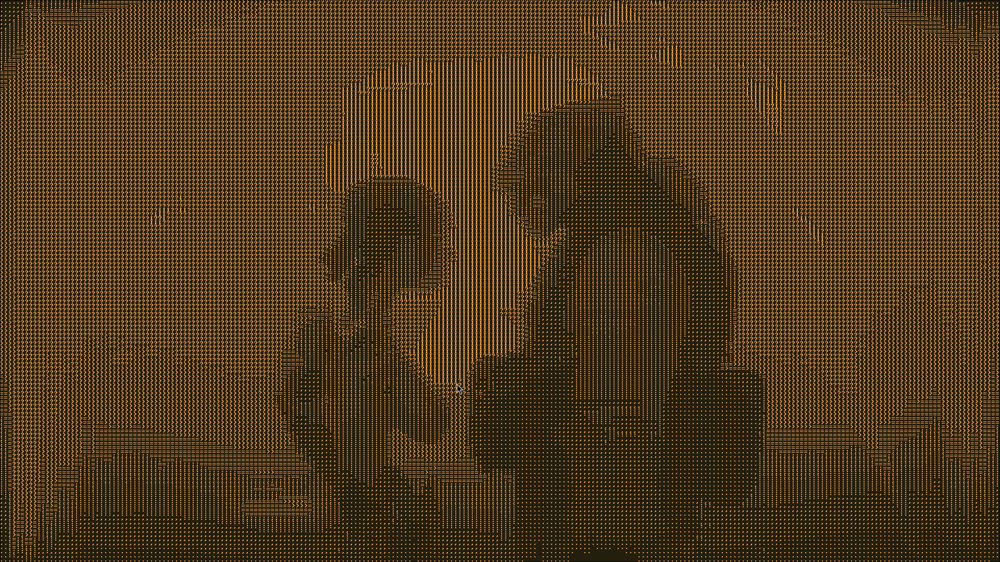

# vid2ascii

This is a small command line program that applies
a monochrome or full-color ASCII or tiled "dithering" effect to
a video.

This a small hobby project that happened to be an interesting
lession in code generation and optimization on the
assembly level. You can read more about that in
[this blog post](https://snowol.dev/posts/2026-08-18-vid-to-ascii) I wrote.

Although the program does NOT aim to be fully featured or
production grade and it lacks extensive testing it IS usable.
That's why I decided to share it. There are probably better, faster
and more feature-full alternatives out there, as this was only an
experiment which I wrote without looking at any other examples of
such an effect being implemented.

## Examples

Some example screenshots taken from the output videos the program
produced when using
[the video clip of this song by Noisia and Former](https://www.youtube.com/watch?v=ajDX6rklYb4)
as the input.

### Monochrome /w ASCII setting



### RGB channels /w "tiles" setting


## Limitations & Quirks

* The code will only work properly with 16:9 aspect ratio as the input,
  and the output videos will always be 1920x1080 resolution. Any other
  ascpect ratio will get squished or stretched to this resolution for
  the output.
* This code was NOT tested with every file format and encoding
  under the sun as input or output. However most common ones
  should work as long as ffmpeg supports them (which is basically
  everything).
* The output videos will probably have a considerably larger file
  size (10-100x) than the input files. This is because applying
  lossy compression would totally destroy the effect which this
  code is trying to achive.

## Requirements

The code builds and works on Linux with these packages installed:
* gcc
* make
* [ffmpeg](https://ffmpeg.org/)

## Building

You probably want to use:
```
make RELEASE=1
```

## Running

Example of basic usage:
```
vid2ascii -o output.mp4 input.webm
```

For help with usage and a list of available command line flags use:
```
vid2ascii -h
```

## Contributing

Feel free to fork this repo and improve it if you want to, and then
create a pull request. If it is an improvement or fix of the current
version and does not differ too much in scope or complexity from
it I will probably merge it.


